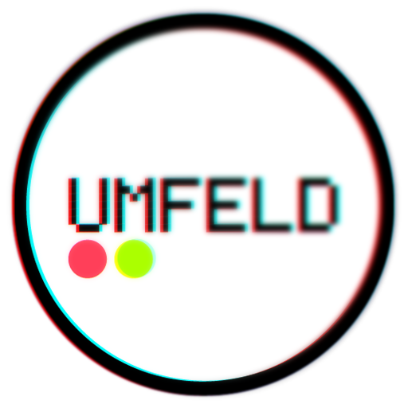

*Umfeld* is a C++ environment for audio- and graphics-based applications. it is inspired by [Processing.org](https://processing.org) and similar environments.

⚠️ *Umfeld* is a *Work in Progress* (WIP) ⚠️ please keep this in mind. if you find a bug, issue, or something missing, or have an idea for improvements or a feature request, please use GitHub’s [Issue Tracking System](https://github.com/dennisppaul/umfeld/issues).

## Features

- processing-style API in C/C++
- simple structure ( e.g `setup()` and `draw()` )
- shape-based drawing ( e.g `line()`, `ellipse()`, `beginShape()`… )
- cross-platform ( macOS, Linux, Raspberry Pi, Windows — potentially iOS, Android, WebGL )
- simple application structure: one `.cpp` file + `CMakeLists.txt`
- CMake-based build system
- native access to APIs like OpenGL, FFmpeg, PortAudio, and others
- small, portable builds

## Quickstart

### 1. Prepare

- on *macOS*: no preparation needed
- on *Linux*: open a console and run `sudo apt install -y git curl`  
- on *Windows ( MSYS2 UCRT64 )*: install [MSYS2](https://www.msys2.org/) and open the `MSYS2 UCRT64` console

### 2. Install Dependencies + Download *Umfeld*

open a console, navigate to the desired installation folder, and run the following script:

```sh
/bin/bash -c "$(curl -fsSL https://raw.githubusercontent.com/dennisppaul/umfeld/main/install.sh)"
```

this script installs all required packages ( on *macOS*, *Linux* ( including *Raspberry Pi OS* ), and *Windows ( MSYS2 UCRT64 )* ) and downloads *Umfeld* with examples and external libraries into the current directory.

⚠️ IMPORTANT ⚠️ on *Windows ( MSYS2 UCRT64 )*, the console might close when running the script above. this is expected behavior ( part of the self-updating process ). just run the script again. it should work fine the second time.

### 3. Build + Run an Example

run an example ( e.g. `minimal` ) to see if *Umfeld* works. navigate to the folder and run the CMake build commands:

```sh
cd umfeld-examples/Basics/minimal
cmake -B build
cmake --build build
./build/minimal
```

if everything works fine look into [Developing-Applications](Developing-Applications.md).

> tip: if something goes wrong, consult the notes below or the detailed [DOCUMENTATION](documentation/DOCUMENTATION.md).

> tip: another quick way to get started on the *Raspberry Pi* is to use the [pre-configured ISO image](http://dm-hb.de/umfeld-rpi) ( see [Umfeld on RPI / Quickstart](documentation/Umfeld-on-RPI.md#Quickstart) ).

## Why *Umfeld*?

well, *Umfeld* is actually imitating [Processing.org](https://processing.org) quite bluntly ;) or a compliment to the original [Processing.org](https://processing.org) project, or a token of respect.

this project aims to supply a framework that allows writing applications that more or less look like original [Processing.org](https://processing.org) sketches.

*Umfeld* may also function as a statement on what is good and valuable about the [Processing.org](https://processing.org) *idiom* while at the same time disconnecting it from one specific group, application or project … maybe a bit like markdown in that sense.

*Umfeld* is yet another programming environment for designers, makers, and artists. so why does it exist? and why not use [Processing.org](https://processing.org), [OpenFrameworks](https://openframeworks.cc), [Cinder](https://libcinder.org) or any of the other frameworks out there?

well, the main reason why we even created *Umfeld* was basically to have a C++ derivative of Processing.org that stays very close to the *original* idiom. while Cinder and OpenFrameworks, for example, are fantastic projects, they differ quite a lot from the *Processing.org Idiom* ( i.e a `setup()-draw()` structure, `stroke()+fill()` and shape-based drawing, etcetera ). *Umfeld*, however, literally imitates core Processing classes and functions.

why not use the original Java-based *Processing.org* then? there are a few key aspects that just cannot and probably will never be resolved due to limitations imposed by Java. while Java is a very well-designed language and does many things better than C/C++, it has some drawbacks.

the most important benefit of moving to C/C++ is the availability of many extremely powerful and widespread libraries and APIs ( e.g OpenGL, OpenCV, FFmpeg, PortAudio ) that can be natively used and integrated into applications and sketches without the need for a native binding library. while many of these libraries have been fully or partly made accessible in Processing through native bindings, oftentimes these libraries or their bindings introduce significant overhead ( technically, administratively, etcetera ), are not at the current version, are incompatible with newer versions of OSes, or do not expose all functionality ( e.g unstable webcam support on macOS ). while this also happens with C/C++ libraries and APIs, the problems are greatly reduced. also, there is still a significant number of libraries and APIs not available for Java-based Processing or that are impossible to port because of limitations posed by Java VM implementations ( e.g multi-channel audio ).

in addition to this, due to the nature of C/C++ and the way *Umfeld* is implemented, applications and sketches developed with *Umfeld* can be built and deployed with a very(!) small memory and CPU footprint. this means that applications and sketches can potentially run on smaller or older hardware like, e.g Raspberry Pi. some modules can even be excluded from a build to reduce the footprint even more. *Umfeld* can even run *truly* headless ( i.e it does not require any virtual offscreen graphics driver if no window is required ).

furthermore, *Umfeld* uses CMake as a build system. CMake is very well-designed and more or less easy to learn and extend. this also means that *Umfeld* applications and sketches can be developed in more or less any text editor or IDE ( e.g Visual Studio Code, Zed, CLion, Vim ). it does not require proprietary build systems like Xcode.

and finally, although C and especially C++ is known for its horrific errors, confusing error messages, and volatile behavior at times, with the advent of LLM-based programming assistants, the entry threshold can be greatly reduced. trust the process. PS ( if *vibe coding* is even a thing this should be easy ;) )

PS note the character of this project is that features will be added as they are needed. it might partly replicate but not fully emulate the original [Processing.org](https://processing.org) environment.

see [DOCUMENTATION](documentation/DOCUMENTATION.md) for usage information and [examples](https://github.com/dennisppaul/umfeld-examples) for applications.

## Credits

this project relies on the following libraries and packages:

### Handled by Package Managers

- [CMake](https://cmake.org/) `@version(macOS, 4.0.3)`
- [pkg-config](https://www.freedesktop.org/wiki/Software/pkg-config/) `@version(macOS, 2.4.3)`
- [SDL3](https://www.libsdl.org) `@version(macOS, 3.2.16)`
- [HarfBuzz](https://github.com/harfbuzz/harfbuzz) `@version(macOS, 11.2.1)`
- [Freetype](https://www.freetype.org/) `@version(macOS, 2.13.3)`
- [ffmpeg](https://ffmpeg.org) `@version(macOS, 7.1.1)`
- [rtmidi](https://github.com/thestk/rtmidi) `@version(macOS, 6.0.0)`
- [glm](https://glm.g-truc.net/) `@version(macOS, 1.0.1)`
- [dylibbundler](https://github.com/auriamg/macdylibbundler) ( only required for bundling standalone macOS applications. it can also be installed via homebrew with `brew install dylibbundler` ) `@version(macOS, 1.0.5)`
- [PortAudio](https://www.portaudio.com) ( can be used as a replacement for SDL-based audio. in contrast to SDL it can output audio to multiple channels. it can also be installed via homebrew with `brew install portaudio` ) `@version(macOS, 19.7.0)`
- [cairo](https://www.cairographics.org) `@version(macOS, 1.18.4)`
- [curl](https://curl.se) `@version(macOS, 8.14.1)`
- [ncurses](https://invisible-island.net/ncurses) `@version(macOS, 6.5)` ( on Windows `ncurses` is replaced by `pdcurses` )

( version numbers reflect the setup on macOS and are only updated sporadically )

### Included as Source

- [oscpack](http://www.rossbencina.com/code/oscpack) ( included as source files )
- [dr_libs](https://github.com/mackron/dr_libs) ( included as source files )
- [SimplexNoise](https://github.com/SRombauts/SimplexNoise) ( included as source files )
- [stb_image + stb_image_write](https://github.com/nothings/stb) ( included as source files )
- [tiny_obj_load](https://github.com/tinyobjloader/tinyobjloader) ( included as source files )
- [tinyfiledialogs](https://sourceforge.net/projects/tinyfiledialogs/) ( included as source files )
- [PolyPartition](https://github.com/ivanfratric/polypartition) ( included as source files )
- [earcut.hpp](https://github.com/mapbox/earcut.hpp) ( included as source files )
- [libtess2](https://github.com/memononen/libtess2) ( included as source files )
- [glad](https://github.com/Dav1dde/glad) `@version(2.0.8)` ( included as source files )

( `@version(macOS, X.X.X)` states the platform and version number of the library with which *Umfeld* has been tested on macOS. other versions might work as well but are not guaranteed to. )

and as mentioned before of course [Processing.org](https://processing.org)

## Documents

- [Additional-Umfeld-Functions](Additional-Umfeld-Functions.md) :: list of functions added to *Umfeld* that are not part of *Processing.org*
- [Developing-Applications](Developing-Applications.md)
- [DOCUMENTATION](DOCUMENTATION.md) :: detailed documentation on how to build from source, caveats, application structure etcetera
- [Known-Issues](Known-Issues.md)
- [Processing-Function-Availability-Status](Processing-Function-Availability-Status.md) :: list of functions that are part of *Processing.org* and available in *Umfeld*
- [Setting-up-Homebrew-on-macOS](Setting-up-Homebrew-on-macOS.md) 
- [Tested-Setups](Tested-Setups.md)
- [Umfeld-CMake-Options](Umfeld-CMake-Options.md)
- [Umfeld-in-CLion](Umfeld-in-CLion.md) :: instructions on how to run an *Umfeld* application as a *CMake* project in *CLion*
- [Umfeld-in-Visual-Studio-Code](Umfeld-in-Visual-Studio-Code.md) :: instructions on how to run an *Umfeld* application as a *CMake* project in *Visual Studio Code*
- [Umfeld-on-RPI](Umfeld-on-RPI.md) for platform-specific instructions
- [RELEASE_NOTES](RELEASE_NOTES.md)

## Umfeld Repositories

- [Umfeld](https://github.com/dennisppaul/umfeld) :: this repository, containing the *Umfeld* library
- [Umfeld Examples](https://github.com/dennisppaul/umfeld-examples) :: a repository containing all the examples. note, that the examples assume that `umfeld` and `umfeld-examples` are located in the same folder.
    ```
    .
    ├── umfeld
    ├── umfeld-examples
    └── umfeld-libraries
    ```
- [Umfeld Libraries](https://github.com/dennisppaul/umfeld-libraries) :: a repository containing some libraries ( e.g Dear ImGui ) to extend *Umfeld*
- [Umfeld Arduino](https://github.com/dennisppaul/umfeld-arduino) :: an ( experimental ) *board definition* to run *Umfeld* applications from Arduino IDE or `arduino-cli`
