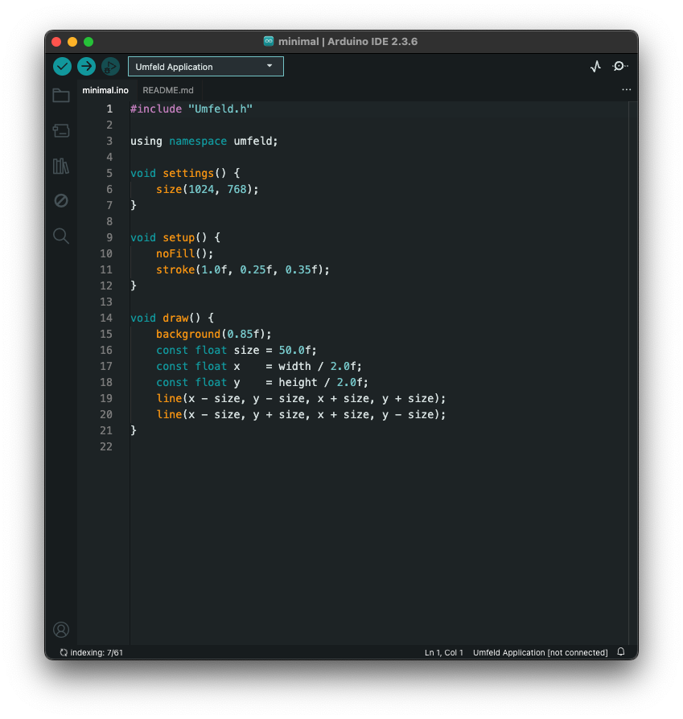
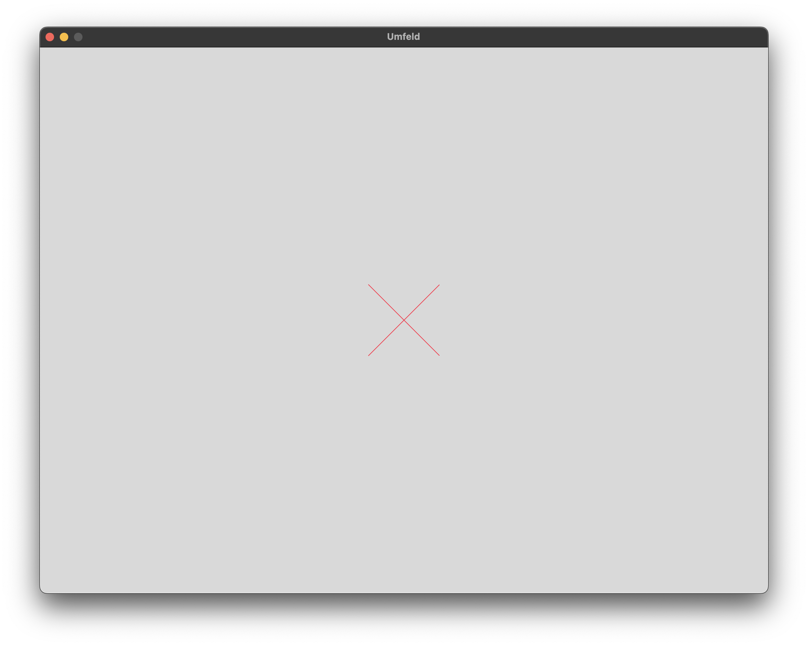

⚠️ THE PROJECT HAS MOVED TO CODEBERG.ORG [https://codeberg.org/Umfeld](https://codeberg.org/Umfeld) ⚠️

Board definition to run [Umfeld](https://github.com/dennisppaul/umfeld) as a board from Arduino IDE or CLI.

## Prerequisites

- install [Arduino IDE](https://www.arduino.cc/en/software) and/or [`arduino-cli`](https://docs.arduino.cc/arduino-cli/installation/)
- install [Umfeld](https://github.com/dennisppaul/umfeld#Quickstart)

## Installation

- navigate to the *Arduino* folder ( the sketch folder that also contains libraries )
    - on macOS the folder is usually located at `$HOME/Documents/Arduino`
    - on Linux the folder is usually located at `$HOME/Arduino`
    - on Window the folder is usually located at `%HOMEPATH%/Documents/Arduino`
- create a `hardware` folder ( if it does not exist already ) 
    ```sh
    ├── hardware
    └── libraries
    ```
- download [`umfeld-arduino`](https://github.com/dennisppaul/umfeld-arduino/releases/latest) as a ZIP and unpack it in `hardware` folder 
- or clone it into `hardware` folder
    ```sh
    .
    ├── hardware
    │   └── umfeld-arduino ( <<< this repository )
    │       ├── LICENSE
    │       ├── README.md
    │       └── umfeld
    └── libraries
    ```
- check if things are working in *Arduino IDE* 
    - open a sketch ( e.g `minimal` from `umfeld-arduino/umfeld/examples` folder )
    - select *Umfeld* *board* from `Tools > Board:… > Umfeld (in Sketchbook) > Umfeld Application`
    - run ( i.e *upload* ) sketch by clicking `Upload` or pressing `CMD+U`
- check if things are working in `arduino-cli`
    - open console ( assuming `arduino-cli` is installed )
    - `cd $HOME/Documents/Arduino/hardware/` navigate to hardware folder e.g on macOS
    - `arduino-cli compile -u -b umfeld-arduino:umfeld:UMFELD ./umfeld-arduino/umfeld/examples/umfeld/minimal` build (`-b`) run ( i.e *upload* `-u` ) `minimal` example

either way you should see something like this:





### A Note on *Arduino IDE* on Windows

TL;DR if you want to use *Arudino IDE* include *MSYS UCRT64* into `PATH`.

*Umfeld* on Windows is a bit bumpy; it requires the *MSYS UCRT64* environment to work properly. so, if you plan to use the *Arduino IDE* to build and run sketches, you need to make the *Arduino IDE* ( or the entire system ) aware of *MSYS UCRT64*. the Windows environment variable `PATH` needs to contain the *MSYS UCRT64* when *Arduino IDE* runs. without this *Arduino IDE* will not be able to access the compiler ( and other tools ). there are multiple ways to achieve this:

#### set `PATH` system-wide

1. press `WIN+R`, type `sysdm.cpl`, press enter
2. go to `Advanced > Environment Variables`
3. in the bottom section (*System variables*), find `Path`, click `Edit`
4. add a new entry, paste in: `C:\msys64\ucrt64\bin`
5. click `OK + OK + OK`
6. restart *Arduino IDE* ( maybe even log out/in or reboot).

caveat: this makes *all programs* use *UCRT64*’s `g++`, `ld.exe`, etc. If you also have *MinGW*, *LLVM/Clang*, or other toolchains on `PATH`, order matters. Windows uses the *first* matching executable.

#### use `.bat` to launch *Arduino IDE*

create a `.bat` that sets `PATH` only for the IDE process:

**arduino-ide-launch.bat**

```sh
@echo off
set "PATH=C:\msys64\ucrt64\bin;%PATH%"
start "" "%LOCALAPPDATA%\Programs\Arduino IDE\Arduino IDE.exe"
```

double-click `.bat` to start *Arduino IDE*.

#### launch *Arduino IDE* with `PATH` override

Windows shortcuts can store environment overrides. Create a shortcut to Arduino IDE.exe, set *Target* like:

```sh
cmd /C "set PATH=C:\msys64\ucrt64\bin;%PATH% && start "" "C:\Program Files\Arduino IDE\Arduino IDE.exe""
```

### Installing on macOS with CLI

open a console and execute the following commands:

```sh
mkdir -p $HOME/Documents/Arduino/hardware
cd $HOME/Documents/Arduino/hardware/
git clone https://github.com/dennisppaul/umfeld-arduino
# with `arduino-cli`
arduino-cli compile -u -b umfeld-arduino:umfeld:UMFELD ./umfeld-arduino/umfeld/examples/umfeld/minimal
# or *Arduino IDE*
open umfeld-arduino/umfeld/examples/umfeld/minimal/minimal.ino
```

### A Note on Installing Arduino CLI on Ubuntu

on Ubuntu 22.04.3 the standard installation instructions failed, but the following steps worked:

```sh
cd $HOME
curl -fsSL https://raw.githubusercontent.com/arduino/arduino-cli/master/install.sh | sh
export PATH="$HOME/bin:$PATH" # temporary add  and should be added to startup file
arduino-cli --version 
```
